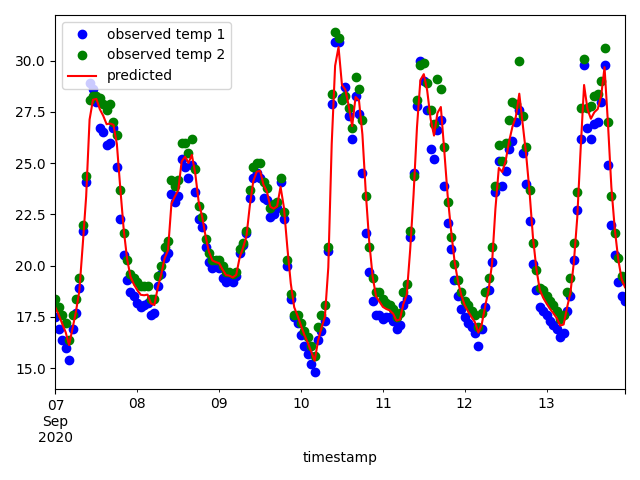
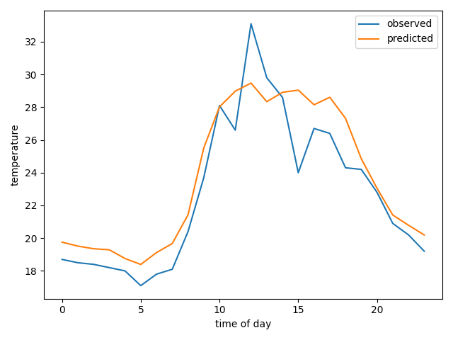
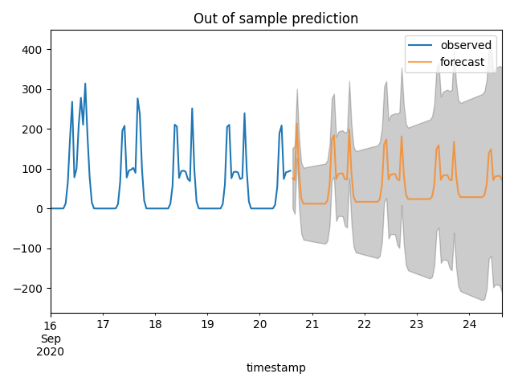

## Data sets and example code


## Data sets 

[Click here for an overview available data sets](data) 

## Example scripts for 30mhz exercises

### import.py

Reads one of the example .csv files
into a Python Pandas DataFrame.

```
# install dependencies
pip install pandas matplotlib
```

### kalman.py

Kalman sensor fusion example.

```
# install dependencies
pip install pandas matplotlib pykalman numpy scipy
```



### pytorch.py

Basic Pytorch RNN temperature model
that predicts average greenhouse temperature sensor data
over the course of a day.

```
# install dependencies - additionally, see below for PyTorch install.
pip install pandas matplotlib numpy
```
Next, install PyTorch itself according to https://pytorch.org/get-started/locally/ .



### sarima.py

Basic Seasonal (S)ARIMA model on PAR Sensor (sunlight) data.

```
# install dependencies
pip statsmodels matplotlib pmdarima pandas numpy
```



### svr.py

Support Vector Regression model
that predicts humidity from temperature sensor data.

```
# install dependencies
pip sklearn matplotlib pandas numpy
```


