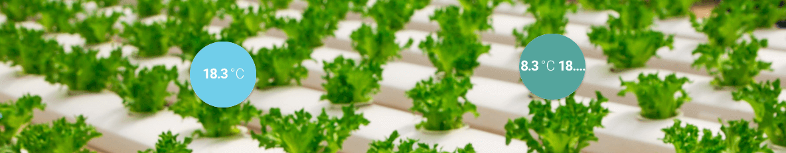

# JADS Data-Driven Food Value Chain

## Introduction to Sensors - data, examples, and exercises

### 30Mhz main exercise

[Example models and data](30mhz)

Create your own dashboard, and explore the greenhouse sensor data. Then download a dataset that interests you, and create a relevant model with it. 

Your new model can be based on one of the available example models, or you can create a new model from scratch, depending on your Python and data analytics skills. 

Use at least two sensors to predict the output of one other sensor.

### Micropython Lunar Lander filter exercise

[Micropython Unicorn basic filter example](micropython)

One of the main differences of coding for an MCU is that they offer very few resources. It is generally not possible to use large Python libraries such Numpy or Scipy.

The Lunar Lander assignment requires you to implement a filter while working around these limits.

The most creative solution can win a PyBoard (for those interested in owning one).

### MQTT mini-exercise

[MQTT chat](mqtt)

A minimal MQTT chat example. Run it, and chat with your follow students. Feel creative? Work together with your team, let one of your team publish data and another(s) receive data, respectively generated by and analyzed with https://github.com/jmaces/statstream

### Scailable edge computing exercise

[Scailable 101](https://github.com/scailable/sclbl-tutorials/blob/master/sclbl-101-getting-started/README.md)

Time left? Help us out, and test drive our Scailable platform! Just follow the [Scailable 101](https://github.com/scailable/sclbl-tutorials/blob/master/sclbl-101-getting-started/README.md) to get started! 

### TTGO HiGrow example code

[TTGO HiGrow with MQTT Cayenne integration](higrow)

An example of a complete sensor board to dashboard solution. 

